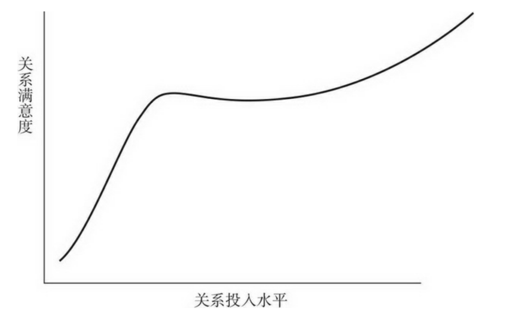

与他人相互交换理想的奖赏是社会生活所必需的， 这一过程就是社会交换

人际交往中的奖赏指的是，我们与他人接触时所获得的令人高兴的经验和物品。代价是具有惩罚性的、令人不悦的经验。某一特定的人际交往所带来的奖赏和代价之和就是结果。

结果=奖赏-代价

人际交往的结果 是正还是负并不重要，重要的是我们评价结果的两个标准。第一个标准是我们的期望，第二个标准是假如没有现在的伴侣，我们认为自己会过得怎样

即使你在与他人的交往中仍有所收益，如果这一收益没有大到足够满足你的期望，你仍不会感到幸福。

相互依赖理论假定每个人都有一个与众不同的比较水平（CL）。如果人们曾有过奖赏价值很高的伴侣关系，就可能有较高的CL。如果过去经历过困难重重的亲密关系，那么他们的期望和CL都会很低。

结果-CL=满意度

替代的比较水平。CLalt是指如果我们抛弃目前的亲密关系，而转投可以选择的更好的伴侣或情境，所能得到的交往结果，就是我们可以容忍目前伴侣的最差结果。

如果其他的亲密关系有希望得到比目前的关系更好的收益，即使我们对现状还满意，也有可能离开现在的伴侣去追求更大的收益。另一方面，即使我们对自己目前的亲密关系不很满意，在没有更好的替代选择出现之前，我们也不可能脱离现在的关系。这个观点特别重要，可以解释为什么人们仍会待在使他们痛苦悲惨的亲密关系之中而不离去。如果当前的结果仅比替代选择好一点点，我们就不会非常需要伴侣，如果替代选择不断改善，我们就会离开自己的伴侣。

问题是要算清这些盈亏非常困难。要考虑的因素太多。亲密关系结束时个体失去的投入既包括有形的物品，也包括无形的心理收益，如姻亲和朋友的关爱和尊重。不幸福的妻子可能克制自己 不去提起离婚诉讼，这不是因为她没有可选择的其他好男人，而是因为她不想承担可能的代价，如烦恼的子女、愤恨的前夫、失望的父母、不 解的朋友。所有这些都会减少离开的整体意愿，从而降低个体的CLalt。个体的CLalt是他/她主观认识的产物，自尊就是影响因素之一。如果人们不喜欢自己，他们会怀疑自己的吸引力，从而会低估自己与其他替代伴侣相处的前景。习得性无助也有影响力。如果你是居家式的、不用工作的家庭主妇/夫，与每天到大城市上班相比，得到的替代选择信息就非常有限。

相互依赖理论将满意度和依赖性视为亲密关系中相对独立的影响因素，但它们实际上是相关的。但如果你和目前的伴侣在一起很幸福，你就不太可能注意到。

亲密关系的满意度对于伴侣的去留所起 的作用十分有限。归根结底，人们不幸福时并不会去离婚；但如果在别处的前景最终看来更加光明，不管怎样他们都会离婚。

结果 - CLalt =依赖度

较少依赖亲密关系的人拥有更大的权力。人们更喜欢袭来关系相当的。

设想你找到了完美的亲密关系...,但在连续几个月都享受到这种幸福之后，可能会出现什么情况呢？你已经在期望这些美妙的待遇，这表明你的比较水平提高了。但当你的CL升高而关系结果维持不变，满意度就会下降.这样一来，即使没有任何改变（除了我们的期望），具有奖赏意义的亲密关系也会逐渐变得越来越不满意。非常明显，找到你生命中的真爱并不能让你永远幸福.事实上，平均而言，美国人现在的婚姻并不如30年前的那般幸福，原因之一或许就是人们有着更高的CL

过于关注伴侣交往过程的奖赏和代价，会使我们忽视其他影响伴侣关系成败的重要因素。比如，你在重要的亲密关系中能否最终取得成功，有时或许取决于你适应外部不可控压力的能力.此相敬如宾的伴侣比起那些彼此提供奖赏较少的伴侣更可能长相厮守

在任何一天，44%的人很可能被爱人或者好友惹恼。

据正在恋爱的大学生的自我报告，每周平均会发生8.7次恼人的吵闹，算起来每天都会有至少一件令人沮 丧的麻烦事发生。根据婚姻生活中配偶的自我报告，每月一般会发生一两件不愉快的争执。长期保持的亲 密关系显然会发生很多生气和恼怒的事件，这点或许超过一些人的想象。

要保持满意的亲密关系，我们或许需要保持至少5:1的奖赏-代价比率。

要想亲密关系兴旺繁荣，需要更多的奖赏而不是减少代价。

93%的已婚夫妻报告做爱的次数远高于争吵的次数，而没有一对痛苦的夫妻是这样做的。

伴侣彼此为对方所做的一些意图良好的事情，而在对方的 眼里好像并没什么特别体贴或充满深情之处。一项研究连续四周追踪测量了伴侣们的知觉，发现两性对其伴侣所说的正面行为的注意还不到四分之一。疏离性或恐惧型依恋的丈夫和妻子尤其可能觉察不到伴侣为他们做的积极、关爱的事情

奖赏和代价对影响亲密关系是各自独立。愉悦和痛苦各自独立起作用，它设计不同脑机制引起不同的行为和情感。愉悦和痛苦并存，也可同时缺失。

图6.4
奖赏形式包含任务和责任(比如把垃圾带出门)，情感和关爱(说"我爱你")
妻子欣赏丈夫的关爱行为，丈夫则是喜欢妻子任务指向的帮助行为。询问配偶们如果能改善关系，最想改变什么时，妻子表示渴望丈夫更多的关爱，丈夫则想要更多的性事。
如果人们做出很小的牺牲来取悦伴侣(比如陪伴侣去看自己不喜欢的电影)，他们就有接近动机，愿意追求更多的亲密感。具有回避动机的人会努力避开冲突，他们很吝啬，不愿做出牺牲，其亲密关系受损。

我们当然希望能避免令人痛苦的冲突和其他代价，但如果亲密关系要兴旺繁荣、快乐充实，我们需要做的不仅仅是避开痛苦的冲突和其他代价。我们还要还要克服沉闷的亲密关系：必须尽力满足他们的接近目标，为伴侣提供快乐的、有趣的、兴奋的经验

新奇的活动、新才能的发展和新的思想观点的获得都具有内在的满足性.这就是为什么刚刚恋爱的人常常会快乐无比的原因所在：新建立的亲密通常包含有知识的增加和能促进自我概念发展的相互关系.一旦新的伴侣逐渐变得熟悉起来，自我延伸往往会变慢，这时许多人会开始觉得伴侣关系比起当初刚建立时显得更为枯燥和平庸。根据自我延伸模型，保持快乐的关键是创造性地发现持续你个人成长的方法.在继续寻求新奇的活动和挑战

许多亲密关系不幸福的另一个可能原因是，在夫妇建立亲密关系之时他们的交往还是有奖赏意义的，但是后来情况发生了改变.

在亲密关系最初阶段满意度快速增加以后，许多配偶会进入一段平静期，他们要调整以适应他们之间日益增加的相互依赖。成功的亲密关系熬过这段重新评价的时期后，就会变得更加令人满意，但增加的速度更平缓。

随着新伴侣共处时间的增多，开始想知道亲密关系的前景，彼此的生活习惯也会发生摩擦，这样新建立的亲密关系的动荡和混乱也会增加。当伴侣决定更严肃地投入时，这一动荡到达了顶峰，但随着伴侣们彼此调整适应了他们新的相互依赖方式，动荡随即减少

有些夫妻婚姻满意度的下降比图中更快，但也有些人满意度根本不会下降

满意的夫妻往往具有低神经症和高自尊的特征；即使讨论棘手的难题也带着关爱和幽默，不会滋生愤怒；他们遭遇的应激源（如经济困难和健康问题）也相对较少。久而久之，他们交往的结果毫无疑问更为积极，相形之下，另一些夫妻则更为烦躁、粗暴、不安全，麻烦不断，不堪重负，相互依赖理论认为这就是前者婚姻更为满意的原因所在。

幸福的配偶会控制其期望，故而他们的CL不会太高。最幸福的夫妻是那些一开始就对婚姻生活有着最现实看法的人。

对亲密关系之未来保守而慎重的期望远比浪漫的理想主义更明智和理性。我们都知道怎样才能显得谦恭有礼和体贴入微，如果我们愿意就能做到。但这样做需要花心思。比如一旦求爱成功、拥有了伴侣，人们或许不再会去努力一直保持风度翩翩。在盲约中从不大声放屁的人，可能会在成为夫妻后就随意地在餐桌旁放响屁。
相互依赖会放大冲突和摩擦。
亲密意味着伴侣了解你的秘密、缺点和劣势。如果发生冲突，这些就是伴侣用来嘲笑和伤害我们的武器。
婚后仍有意料不到的麻烦。第一种，了解了那些我们自以为已知事情的真相，前文说的致命吸引；第二种获悉了那些你根本不知道的令人讨厌的事情，如“孩子出生后，婚姻关系将明确无误地走向黯淡”。养育孩子是件无休止的工作，大多数父母会发现，一起快乐相处的时间急剧而意外地减少了，当孩子出生，冲突会增多，对婚姻的满意度（以及对伴侣的爱）会减少,这在全世界都普遍）。如果年轻的父母没有预料到这些困难，将来肯定会大吃一惊。

人们如果对亲密关系抱持一种不切实际、美化夸大的期望，即使做得比其他人都好，其亲密关系也只能以失望告终

（1）缺少努力（lack of effort）；（2）相互依赖的放大镜作用（interdependency is a magnifying glass）；（3）对敏感信息武器的了解（access to weaponry）；（4）不受欢迎的意外（unwelcome surprises）和（5）不现实的期望（unrealistic expectations），人们通常不能维持步入婚姻时的那种亲密关系结果。我们认为对这些问题的深刻理解，有助于人们避免不必要的失望，甚至有助于预防和避免亲密关系结果的下降。这一观点提醒了我们始终不渝的责任，要尽可能和蔼愉悦地对待自己所珍视的伴侣。我们期待美满的关系结果，伴侣也一样，即使他们喜欢我们，如果我们不能给予他们足够的奖赏，他们也会移情别恋。

如果你想使珍视的亲密关系继续下去，确保伴侣对你的依赖和你对伴侣的依赖程度一样，这对你是非常有利的。如果伴侣双方都想亲密关系持续，双方都应该深思熟虑地保护和维持对方的幸福。

寻求共有关系的人不会严格计算自己付出的代价，他们不会热切地希望自己的付出能立刻得到报答；即使没有机会得到好处，也会密切关注伴侣的需要；如果能帮到伴侣则自我感觉非常好。在共有的亲密关系中，人们常会为伴侣做出一些小牺牲，彼此帮对方的大忙，结果是他们享受到更高质量的亲密关系

交换的观点看起来似乎并不适合更亲密的关系，因为当伴侣们进展顺利时，他们享受到“盈余经济”，似乎不太在意对方做得怎样。当出现不满意时，处于（曾经是）共有关系中的人们也常常变得对关系结果的些微不公特别敏感

正如相互依赖理论所揭示的，大多数人似乎认识到，如果想让别人对你好，你必须先要对别人好。

你的关系结果/你的关系贡献=伴侣的关系结果/伴侣的关系贡献

伴侣甲 伴侣乙
(1)80/50 = 80/50
(2)20/100 = 20/100
(3)50/25 = 100/50
三者都公平，1比2亲密

伴侣甲 伴侣乙
(4)80/50 ≠ 60/50
(5)80/50 ≠ 80/30
关系是不公平的。在这样的情形下，一方过度获益，得到的满意结果超出其应该得到的；另一方获益不足。相互依赖理论认为只要伴侣双方发展顺利，就没有太大的影响。但公平理论却认为影响很大。

公平理论最有意思的一个方面是，它明确地认为处在不公平的亲密关系中的任何人都是紧张的。公平理论认为，只有伴侣双方都得到公平结果时，每个人才最为满足。最令人满意的情形是公平分享关系结果；公平理论预测过度获益的人某种程度上不如公平关系中的人满足，而获益不足的人将更加不满意.
你可以改变你（或者伴侣） 的贡献或结果来恢复实际的公平。你可以要求更好的待遇以便改善结果。—或者你减少自己的贡献而希望结果保持原状。如果这些努力都失败了，你可以尝试恢复心理上的公平。改变你对亲密关系的认知，使你自己信服它毕竟就是平等的关系。最后，也是不得已的手段，你可以放弃关系去别处寻找公平。

公平理论不适用于所有情况。在不同的亲密关系中，某些人始终比其他人更珍视公平，所以与其他人不同，这些人在存在公平时比不存在时更为满意。但令人好奇的是，这些人对他们亲密关系的总体满意度并不如那些不太关注公平的人。但是，无论我们是上述的哪类人，公平在某些领域尤为重要。在家务劳动的分配和照料小孩这两个敏感问题上，保证公平是明智之举。当人们不满意时，公平问题才凸显出来，而当人们满足时，则会显得微不足道。过度获益似乎不会太烦扰人们，而公平在已经具有很高奖赏价值的亲密关系中其积极作用甚微。

如果奖赏高而成本（和期望）低，人们最为快乐。但因为在亲密关系中我们寻求的奖赏取决于伴侣，所以满足伴侣也与我们的利益攸关。如果我们希望亲密关系持续，我们会很乐意保证亲密伴侣的幸福，并且很少会剥削他们。这样的行为或许受到自私动机的激励，但它仍是周到体贴、宽容大度和充满爱意的。

投入模型认为在以下三种情况下人们希望与现有的伴侣保持亲密：感到幸福；没有其他更好的选择；离开的代价太高

承诺的特征之一是指向长期发展，这能减少亲密关系遭遇坎坷时产生的痛苦。

承诺引起的最重要的结果可能是，它会使人们采取行动以保护和维持亲密关系，即使这样做的代价很高

承诺会促进顺应性行为，人们会克制自己不以愤怒来应对伴侣的愤怒；承诺的人还表现出更大程度的牺牲意愿。承诺会改变人们对伴侣关系的认知。承诺的人表现出感知到的优越感——他们认为自己的亲密关系比别人的更好