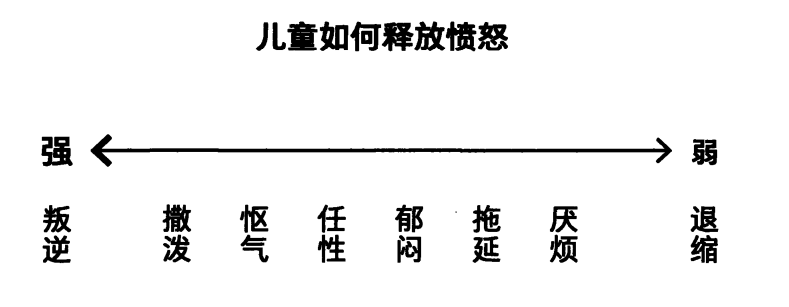
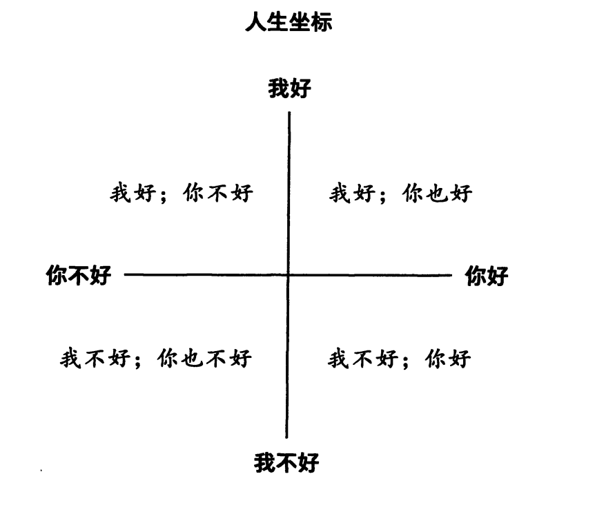

## 必须完成的事情，唯有靠自己才能完成

## 儿童自我状态。没有好坏，只是描述状态。
1.快乐和深情
2.愤怒
3.悲伤
4.恐惧

## 每一个婴儿都必须学习如何调整他的基本行为，来应对自己所处的初始状况。这些调整，就像原子核一样，以后我们所有的行为都围绕着这个核心形成和发展。当然，人生后面阶段的许多其他事件也会对我们造成影响，但这些最早期的经历塑造了人格的雏形，所以我们无法否认也无法忘记它们。 

## 可如果你要更好地理解自己，就需要跟自己的情绪做联结，并理解这些情绪。如果你否认它们， 不论是用无视还是压抑的方式，结果都像是做了截肢，就如身体的重要部位被切掉了一样，你在某种程度上成了一个残缺的人。

## 适应性儿童
1. 顺从行为
2. 同意
3. 取悦
4. 道歉
5. 依赖
   

## 'PLOM'的游戏(Poor Little Old Me)。我用'共谋’是想说，你偷偷地或无意识地配合对方，来给自己制造不快，这就是在玩心理游戏，而且在游戏里输的人才算是赢家。我在努力让自己活得悲惨。因为这些概念最容易打破我们的心理平衡，它们最有可能带你走向深层的蜕变，而这个过程往往是痛苦的，我想你现在也感受到了。我们看到的自己，并不一定总是我们喜欢的样子。从当下的你，变成你想成为的自己，必定要经历行为和态度的转变，需要付出艰辛的努力，需要勇气和决心。所以蛤蟆，你现在应该懂了，为什么你会拒绝打开这扇学习之门，因为它通向一条艰苦之路。一些概念，乍一听会显得愚蠢、不合逻辑，甚至让人害怕。但是越是能帮助你深入自我的概念，也越容易引发激烈的阻抗。

## 父母自我状态
“处于’父母自我状态’时，我们表现得正如自己的父母。记住，他们是我们最早接触的人，因此对我们的影响是不可估量的。'父母状态'包含了自出生起，我们从父母那里学到的所有价值观和道德观，还包含了对生活的评判标准，让我们借此判断是非对错。这些价值观来自父母，所以父母是最能左右我们行为的人。他们的言行塑造了我们童年的生活，也不可避免地对我们之后的人生产生影响。

## 能帮你的人是你自己， 也只有你自己。有许多问题需要你向自己发问。比如你能停止自我批判吗？你能对自己好一些吗？也许最重要的问题是，你能开始爱自己吗？

## 没有一种批判比自我批判更强烈，也没有一个法官比我们自己更严苛。你能开始爱自己吗

## 自我状态的三位一体，分别是父母、成人、儿童状态。这个三位一体也代表了人格的结构。

## 成人自我状态 '指我们用理性而不是情绪化的方式来行事。它让我们能应对此时此地正在发生的现实状况。意思是，在这个状态下，我们能计划、考虑、决定、行动，我们能理性而合理地行事。处于这个状态时，我们所有的知识和技能都能为自己所用，而不再被脑子里父母过去的声音所驱使，也不会被童年的情绪所围困。相反，我们能思考当下的状况，基于事实来决定要怎么做。只有在’成人自我状态’里，才能学到关于自我的新知识。评估自己的行为，或者倾听别人对你的看法而不马上驳斥，当然这一点很难做到。说到底，是我们'选择'了自己的感受。我 们'选择’了愤怒，我们'选择'了悲伤。但我们做这些选择时都是无意识的，更像是一种条件反射。”

## 为什么难以进入承成人状态？“难，是因为这个过程需要艰辛的努力和刻意的思考。我们在另外两种状态时，像父母或儿童一样行事，几乎不需要去思考，因为我们知道要做什么、说什么，就好像在演戏一样。自我责怪是人处在'儿童自我状态’里做的事情，好像你最喜欢待在那个状态里。但一个处在'成人自我状态'的人，可能会有怎样恰当的做法呢

## 相比责怪，负起责任听着如何？就是，你能开始对此行动了。如果你为自己负责，就会认识到你对自己是有自主权的。因此你就知道自己有力量来改变处境，更重要的是，有力量改变你自己。为自己的行为负责，为自己的情绪负责

## 现在，他渐渐获得了一种能力，让他在回忆时不再谴责自己。他能找到事件之间的联系，能客观地去看，而不再感到内疚。慢慢地，他开始理解为什么有些事情会以那样的方式发生，以及它会带来怎样的影响。换句话说，蛤蟆在反思自己的所作所为，并从中学习领悟。当他用战略的眼光审视人生时，发现从苍鹭那儿学到的某些想法对他帮助极大。比方说，把生活比作舞台并不新鲜，可或许他有专属自己的“人生剧本”，一有机会就出演，这个想法让他耳目一新。蛤蟆甚至不安地想到，也许正是他在无意识中一手策划了各种情境，好让自己的剧本时不时上演。甚至，这是否意味着在他的潜意识（这个词不再让他尴尬）里，关于他人生的“故事情节”早已布局好，一股未知的力量正将他推向某个特定的结局？苍鹭说过“这些想法里存在着真相”，果真如此的话， 那么蛤蟆在出演一个怎样的剧本呢？有时他看起来像是在演喜剧，饰演的是众人嘲讽讥笑的对象，无论他怎样尝试，都无法改写剧本。但最近他开始意识到，也许还有另一种活法， 无须跟着预先设定的剧本走，甚至可以没有剧本，或者说， 可以即兴发挥。不过，这会让人感到害怕，没了剧本，你怎么知道该做什么或说什么呢？剧本至少能让你不用思考，不用为自己做决定。没了剧本，说完“你好”后，要说什么呢？可反过来，想到每一个全新的时刻都意味着独一无二的机会和挑战，又让人无比激动。蛤蟆认定，所谓活得真实， 就是真诚地回应当下的需求。这能打破从童年延续而来的因果循环，让真实的自我摆脱过去经历的束缚，在自由中成为真正的自己。他决定要让自己活得更真实一点儿。

## 我们得回顾你生命最早期的阶段，从出生到大约四五岁的时候，发生的一切都对你影响重大，还影响了你后来的成长，牵涉到你怎样看待自己和别人。这种影响是普遍存在的。童年的经历如此强大、如此鲜活，于是便塑造了每个孩子对世界的独特看法。

## 比如在你童年时，大约四到五岁左右，你会试图回答两个问题。”“第一个问题是：’我是怎么看自己的？我好吗？’第二个问题是：'我是怎么看别人的？他们好吗？’ ”沉默中，蛤蟆思忖着这两个存在主义式的问题。终于，他问：“是谁在问我？ ”“是生命本身，特别是你体验到的生命。”

## 一旦我们在童年决定用哪种态度和观点，我们就会在随后的人生里始终坚持自己的选择。这些态度和观点，变成我们存在的底层架构。从那以后，我们便建构出一个世界，不断确认和支持这些信念和预期。换一个词来说，我们把自己的人生变成了一个’自证预言'。”

## 我不好，你好。几乎在任何方面。低自尊的人通常觉得生活对他们不好，却更善待别人。概括地说，处在这个坐标的人认为自己是生活的受害者，所以他们就玩那些会把他们变成受害者的游戏。有些人会竭尽所能地选择记住那些悲伤和不快乐的事件，而忘记或忽略美好的时光。

## 我好，你不好。永远处在挑剔型父母的状态。偶尔处于“养育型父母”的状态。愤怒能够非常有效地抵抗抑郁

## 继续成长和完善就得有目标，而要实现目标就必须好好工作。长久以来，富足的生活削弱了他求职的动力，让他内心的力量和才智流失，变得绵软无力， 好比一个运动员终止了训练。不过，如今他的感受全然不同了，当下他想做的就是去拼、去赢！规划未来

## 有一阵我睡得特别不踏实，醒得又很早。为什么会那样呢？ ”“很难给出确切原因，但那是公认的抑郁症状之一。我 认为和你内心的恐惧有关。当你有恐惧感时，焦虑的念头就会跑到你的意识层面，让你没办法放松。就好像它们在你心里拉响警报，告诉你大事不好了，希望你能做点儿什么。

## '我好；你也好'的人生坐标并非静止的状态，而是动态的过程。你不能说’好了，我终于到了’， 好像登顶珠穆朗玛峰一样。你觉得自己是好的，也相信别人是好的，那就得靠行为和态度持续地对自己和别人展示出来。而这个选择肯定不能给你庇护，免于’残暴命运如投石飞箭般的摧残’。'我好；你也好'其实是一种发自内心信念的行为。

## 询过程中，我们不仅用头脑去思考，也用情感去体验。虽然你开始在理智上理解自己的行为，但要充分理解自我，唯有通过和自己的情绪做联结。当你对情绪的感受越来越清晰时，就能明白它们并非可有可无，也不会对它们不闻不问，因为情绪正是自我的核心。”无论何时，只要我们的情绪真正获得理解，就能有成长的机会。这就是真正在实践中学习。自出生开始，我们便是以这种方式学习任何一种重要的东西